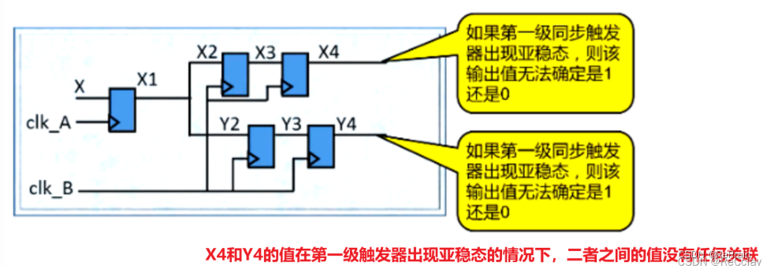

# 跨时钟域总结
https://blog.csdn.net/claylovetoo/article/details/129140192

https://www.51969.com/post/19516477.html

秋招学习跨时钟域
总结一下吧

## 异步电路
设计中有两个或两个以上的频率不同的时钟,同频不同相，或者直接不同频

## 同步电路
整个设计都是使用同一个时钟源，所有时钟的频率和相位都相同

## 跨时钟域(CDC , Clock Domain Crossing )
不同的信号工作在不同的时钟频率下

不同时钟频率下工作的信号往往需要相互沟通和传递信号。

不同时钟域下的信号传递就涉及到跨时钟域信号处理。

## 亚稳态
数据无法在规定的时间段内达到一个稳定的状态


亚稳态主要发生在`异步信号采集`、`跨时钟域信号传输`以及`异步复位电路`等常用设计中

亚稳态输出不确定，但是会传给后一级触发器，这会导致后级电路出错，所以亚稳态危害很大

## 亚稳态产生的原因
- 数据传输中,数据的持续时间没有达到触发器的建立时间`Tsu`和保持时间`Th`要求

- 复位过程中，复位信号的释放时间不满足相对于有效时钟沿的恢复时间（`recovery time`）和移除时间（r`emoval time`）

## 常见错误：组合逻辑信号直接跨时钟域处理
- 因为组合逻辑内部路径不同造成各个输入信号之间有延迟，会出现毛刺（竞争与冒险）


解决方法： 先组合逻辑输出的信号先经过一级D触发器，待数据稳定再进行跨时钟域处理。


## 数据收敛 ：（格雷码编码、握手协议、异步FIFO、DMUX）
如何确保一组相关联的同步信号在经过不同的路径之后可以在某一个相同的时钟周期正确地到达另一个时钟域。也就是`多bit信号的亚稳态`。

## 多路扇出：（先同步后扇出）
一个信号在跨越时钟域之后又分为了多个分支



- 分支后进行跨时钟域处理

    - 同一个信号源经过不同的路径跨越时钟域之后，多路扇出的值不一定相同
- 分支前进行跨时钟域处理
    - 将信号同步之后再多路扇出（即先在时钟域B过两级DFF同步，再将信号扇出，不要在各自的分支上同步）

    

## 数据丢失（快时钟域数据 -> 慢时钟域数据） ：脉冲展宽
输入端信号不能保持足够的时间使得接收端不能采样到数据，导致数据丢失
- 解决方法 ：延长输入信号 （脉冲展宽）


## 异步复位（同步释放）
异步复位信号在释放时不满足恢复`recovery`时间和移除`removal`时间要求，会导致亚稳态

### 恢复`recovery`时间
在有效的时钟沿到来之前，触发器的异步复位信号释放时要提前释放的最小时间。

### 移除`removal`时间
在有效的时钟沿到来之后，触发器的异步复位信号释放时所要保持不变的最小时间


### 解决方法
在异步复位信号`释放`时对其进行`同步处理`（即设计要求中，常讲的：“复位信号——`异步复位同步释放`）

①、异步复位信号之所以会导致触发器出现亚稳态，原因在于：**复位信号释放时不能够与触发器的时钟保持同步**

②、因此可以通过对复位信号同步处理来解决


所谓`异步复位`就是在`reset`信号有效时，立即响应`reset`

所谓`同步释放`就是`reset`信号释放后，等时钟信号到来，再释放

```
//Synchronized Asynchronous Reset
//异步复位、同步释放：只适用于没有PLL的系统复位信号的设置
module sync_async_reset(clock,reset_n,rst_n);
 
    input clock, reset_n;
    output rst_n;
 
    reg rst_nr1;//打一拍
    reg rst_nr2;//打两拍
 
    always @(posedge clock or negedge reset_n) begin
        if(!reset_n) begin
			rst_nr1 <= 1'b0;
            rst_nr2 <= 1'b0;		//异步复位（一旦复位信号有效，就拉低）
        end
        else begin
			rst_nr1 <= 1'b1;
			rst_nr2 <= rst_nr1;		//同步释放（打两拍，再拉高（释放））
		end
    end
	
	assign rst_n = rst_nr2;			//新的系统复位信号rst_n
    //信号rst_n作为新的系统复位信号，后续可以用来直接“异步复位”
	
endmodule							// sync_async_reset


```

## 电平信号、脉冲信号
简单来说，`电平信号`是表示`某种特定状态`的信号，而`脉冲信号`则是用来`进行状态转移`或者`激发操作`的信号


## 单bit跨时钟域

### 慢时钟域数据-> 快时钟域

- 方法 : 使用两个`锁存器` (打两拍)

数据跨时钟域同步过程中,`脉冲宽度`会改变，不影响同步结果


```
`timescale 1ns/1ns

//慢时钟数据跨时钟域到快时钟域
module cdc_slow2fast(
    input clk_s     ,
    input pluse_s   ,
    input clk_f     ,
    output pluse_f
);

    reg pluse_s_ff1 ;
    reg pluse_s_ff2 ; 
    //慢时钟下的数据在快时钟下打两拍
    always @(posedge clk_f)begin
        pluse_s_ff1 <= pluse_s ;
        pluse_s_ff2 <= pluse_s_ff1 ;
    end

    assign pluse_f = pluse_s_ff2 ;
endmodule

```

### 为啥是两级D触发器呢（一级或三级行不行）？
这里有一个 **平均失效间隔时间** `MTBF`(`Mean Time Between Failure`)的考虑。 

`MTBF`即触发器采样失败的时间间隔，MTBF时间越长，出现亚稳态的概率就越小，但是也不能完全避免亚稳态。过一级DFF，相当于乘了一个MTBF，也就是说，每过一级DFF，MTBF就会变大，亚稳态概率就会变小。

`MTBF`越长出错的概率越小。所以一级看上去不太稳，二级差不多够用了，至于三级可能会`影响到系统的性能`，而且`增加面积`，所以看上去`没什么必要`。

### 快时钟域数据 -> 慢时钟域
用两级DFF同步的方法已经无法满足了（慢时钟域仍然无法采集到信号）

此时我们就引入了脉冲展宽信号，`把快时钟域的信号多稳定一段时间`，等到慢时钟域采到了，再拉低，如此便能保证数据的跨时钟域传输。

- 方法1 ：  `脉冲展宽`+`同步`


那么将快时钟域的信号进行`展宽`，但是会出现`毛刺`

```
`timescale 1ns/1ns

module cdc_fast2slow(
    input clk_f ,
    input clk_s ,
    input pulse_f,

    output pulse_s
);
    //在快时钟域下打两拍 
    //目的是为了将脉冲信号展宽，方便识别
    reg [2:0] pulse_f_ff;
    always @(posedge clk_f) begin
        pulse_f_ff <= {pulse_f_ff[1:0],pulse_f} ;
    end

    wire pulse_s_w ;//展宽信号：有1就拉高
    assign pulse_s_w =  | pulse_f_ff ;//按位或
    
    
    reg pulse_s_ff1;
    reg pulse_s_ff2;
    
    always @(posedge clk_s) begin
        pulse_s_ff1 <= pulse_s_w  ;
        pulse_s_ff2 <= pulse_s_ff1 ;
    end
    assign pulse_s = pulse_s_ff2;
endmodule
```
 
 - 方法2 : `脉动电平检测`+`双触发器同步`+`边缘检测`

	- 对快时钟域的电平设置检测信号（翻转）
    - 将翻转信号进行跨时钟域处理
    - 使用两次寄存器打节拍
    - 将两个寄存器信号做异或
```
`timescale 1ns/1ns

module cdc_fast2slow_new(
    input clk_f ,
    input clk_s ,
    input pulse_f,

    output pulse_s
);
    //标志寄存器： 检测快时钟域中的脉冲信号

    reg  pulse_f_flag = 0;

    always @(posedge clk_f) begin
        if(pulse_f)begin
            pulse_f_flag <= ~pulse_f_flag ;
        end else begin
            pulse_f_flag <= pulse_f_flag  ;
        end 
    end
    
    reg pulse_f_ff1;
    reg pulse_f_ff2;
    reg pulse_s_ff3;    //这里的第三拍为了异或操作
    //对标志寄存器做跨时钟域处理
    always @(posedge clk_s) begin
        pulse_f_ff1 <= pulse_f_flag  ;
        pulse_f_ff2 <= pulse_f_ff1 ;
        pulse_s_ff3 <= pulse_f_ff2 ;
    end

    assign pulse_s = pulse_s_ff3 ^ pulse_f_ff2;
endmodule


```

## 多bit跨时钟域处理

- 多bit的跨时钟域为什么不能直接打两拍？

每一个寄存器中的数据在进行跨时钟域处理的时候，从源寄存器到目的寄存器之间的延迟可能会出现不同的路径长度，所以延迟也不能控制完全相等。

###  方法1 ： 慢时钟域-> 快时钟域 : `格雷码`+`同步`
采用格雷码。使相邻两个多bit数据传输过程中，`只有一个bit发生改变`。（多bit变化到单bit变化）`降低亚稳态`的产生。

格雷码**只能在地址或者数值依次增加的情况下使用**。

数值不是依次增加，那么格雷码相邻的数值`不止一个bit发生改变`。

```
`timescale  1ns/1ns

//格雷码+同步的方法只适合两种情况
// 1. 多bit的跨时钟域数值（地址or数据）必须依次变化（增大 or 减小） 
// 2. 必须是慢时钟域数据到快时钟域数据


module gray_cdc(
    input clk_s,
    input clk_f,
    input [3:0] data_in,
    
    output [3:0] data_out 
);

    //二进制2格雷码
    wire [3:0] gray_data;
    assign  gray_data = (data_in>>1) ^ data_in ;

    //跨时钟域处理
    reg [3:0] gray_data_ff1;
    reg [3:0] gray_data_ff2;

    //格雷码2二进制
    reg [3:0] out_data;

    //跨时钟域处理
    always @(posedge clk_f ) begin
        gray_data_ff1 <= gray_data ;
        gray_data_ff2 <= gray_data_ff1 ;
        
    end
    //格雷码2二进制
    integer i;
    always @(*) begin
        out_data[3] <= gray_data_ff2[3];
        for(i=2;i>=0;i=i-1) begin
            out_data[i] = (gray_data_ff2[i] ^ out_data[i+1]);
        end
    end
    assign data_out =out_data; 


endmodule


```

###  方法2 ： 快时钟域 -> 慢时钟域 : `Dmux`

`格雷码+同步`的方法只适合数值依次变化（累加or累减），并且是慢时钟域到快时钟域。

当快时钟域源数据向慢时钟域传输，数据可能被慢时钟域遗漏。
因此在Dmux方法中，需要快时钟域数据在快时钟域下保持几个时钟周期：满足源数据有足够时间传向目的数据


- 条件：支持多bit跨时钟域处理（支持跳变的多bit数据），DMUX在源端的clk信号必须维持好几个目的断时钟周期时间（3-4个）
```
module dmux_cdc #(
    parameter tx_clk = 100,
    parameter rx_clk = 50 ,
    parameter DATA_WIDTH = 8
)
(
    input clk_f ,
    input clk_s ,
    input rst_n  ,
    input [DATA_WIDTH-1:0] data_in ,
    input valid_in ,

    output [DATA_WIDTH-1 :0] data_out,
    output valid_out
);
    reg [DATA_WIDTH-1:0] data_in_ff1;
    reg valid_in_ff1;

    //在快时钟域打一拍
    always @(posedge clk_f or negedge rst_n)begin
        if(!rst_n)begin
            data_in_ff1 <= 'd0;
            valid_in_ff1 <= 'd0;
        end else begin
            data_in_ff1 <= data_in;
            valid_in_ff1 <= valid_in ;
        end
    end

    reg valid_in_ff2;
    reg valid_in_ff3;

    //valid信号在慢时钟域打两拍
    always @(posedge clk_s)begin
        if(!rst_n)begin
            valid_in_ff2<= 'd0;
            valid_in_ff3<= 'd0;
        end else begin
            valid_in_ff2<= valid_in_ff1 ;
            valid_in_ff3<= valid_in_ff2 ;
        end
    end

    //选择器(MUX)
    reg [DATA_WIDTH-1 : 0] data_out_ff1;
    reg valid_out_ff1;
    
    always @(posedge clk_s)begin
        if(!rst_n)begin
            data_out_ff1<= 'd0;
            valid_out_ff1 <= 'd0;
        end else if(valid_in_ff3) begin
            data_out_ff1 <= data_in_ff1;
            valid_out_ff1 <= 'd1;
        end else begin
            data_out_ff1 <= data_out_ff1;
            valid_out_ff1 <= 'd0;
        end
    end
    assign data_out = data_out_ff1;
    assign valid_out = valid_out_ff1 ;

endmodule
```