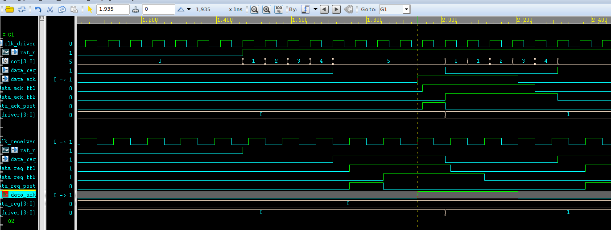

# 多bit跨时钟域处理

- 多bit的跨时钟域为什么不能直接打两拍？

每一个寄存器中的数据在进行跨时钟域处理的时候，从源寄存器到目的寄存器之间的延迟可能会出现不同的路径长度，所以延迟也不能控制完全相等。
## 慢到快时钟域：D_MUX
D_MUX（针对多bits信号+有效信号）。在慢时钟域传递到快时钟域值得注意的是，对有效信号采用两级D触发器缓存，然后作为二选一数据选择器的选择信号 

当data_en为高至少3个clk_fast时，才将data_in数据输出。

思路：
1. 当首个clk_slow到来时，将data_en和data_in信号缓存。

2. 对data_en_reg在clk_fast下额外缓存2个clk_fast，得到b时钟域下的data_en_b。

3. 在clk_fast到来时，根据data_en_b对输出信号赋值。

## 快到慢时钟域： 格雷码+同步(将多bit信号转化成单bit信号)
格雷码是一种循环码（相邻的值之间只有一个bit的不同）

采用格雷码。使相邻两个多bit数据传输过程中，只有一个bit发生改变。（多bit变化到单bit变化）降低亚稳态的产生。

格雷码只能在地址或者数值依次增加的情况下使用。

数值不是依次增加，那么格雷码相邻的数值不止一个bit发生改变。

**同步** ： 慢时钟域到快时钟域才能使用

## 快到慢时钟域 ： Dmux
`格雷码+同步`的方法只适合数值依次变化（累加or累减），并且是慢时钟域到快时钟域。

当快时钟域源数据向慢时钟域传输，数据可能被慢时钟域遗漏。

因此在 `Dmux`方法中，需要快时钟域数据在快时钟域下保持几个时钟周期：满足源数据有足够时间传向目的数据

这里与慢到快不同的是，在慢时钟域对有效信号采用`脉冲同步`+`边沿检测`，然后再作为选择信号输入

- 条件：支持多bit跨时钟域处理（支持跳变的多bit数据），DMUX在源端的clk信号必须**维持**好几个目的断时钟周期时间（3-4个）

## 快到慢时钟域  ： 异步FIFO(基于双口RAM+格雷码实现)

持续写入，数据不间断，（高吞吐量）跨时钟域处理。

坏处：占用资源大，面积大，功耗大
## 快到慢时钟域： 握手同步
分为**发送端**和**接受端**

数据在**发送端**和**接受端**被作为一个寄存器

握手信号`req`和`ack`在时钟之间被同步

这里`req`和`ack` 将原先多`bit`数据当作单`bit`数据，实现跨时钟域

握手步骤：

1. 发送端(`driver`)发起请求(`req`)
2. 接收端(`receiver`)同步请求(`req`)信号
3. 接收端(`receiver`)检测到请求(`req`)信号后将响应(`ack`)信号拉高，搬运数据从发送端(`driver`)到接收端(`receiver`)
4. 发送端(`driver`)同步响应(`ack`)信号，检测到响应(`ack`)信号拉高后，拉低请求(`req`)信号，并计数
5. 计数到某个数，发送端(`driver`)发起请求(`req`)
