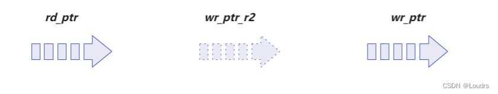

# 异步FIFO问题与要点补充（重要！！！）

https://blog.csdn.net/Loudrs/article/details/131021317

## 什么是虚空与虚满？由什么导致的？对FIFO工作有影响吗？FIFO能正常工作吗？ 

### 先给结论：

由于两级同步器的原因，FIFO的“空”和“满”实际上都是提前出现的，是虚假的，并不是真正的“空满”，提前出现的“虚空”和“虚满”对FIFO的工作效率有影响，但是依然能正常工作。

“FIFO不空仍不读”和“FIFO不满仍不写”虽然降低了FIFO的效率，但这并不是错误，比较保守的设计，因此只要保证FIFO不出现上溢（overflow）和下溢（underflow）就行。


### 在空满判断部分，读空或写满可以理解为：
```
读空时：可以理解为是读指针在追写指针
写满时：可以理解为是写指针在追读指针
```

如上图所示，以读空为例，读指针`rd_ptr`与同步到读指针域的同步写指针`wr_ptr_r2`进行比较，实际上同步写指针`wr_ptr_r2`是`写指针`的**“残影”**，**是写指针两个读时钟周期前的状态**。所以，真正的写指针位于什么位置我们不得而知，但是有一点可以确定的是，写指针至少位于同步写指针的当前位置（写指针要么原地不动，要么继续前进）。所以读指针与“`虚假`”的写指针进行比较，所得到的结果“读空”实际上是“`虚空的`”。同样的道理，写满实际上也是“`虚满的`”。

在这样的情况下，读指针可以更快地“追上”写指针，从而提前出现“空”状态。实际运行的时候，工作效率容易达不到设计目标效率。


## 既然有虚空与虚满，那有“真空”和“真满”吗？真空真满有什么意义？

### 先给结论：
`有“真空”和“真满”，但是没什么意义。`

“虚空”与“虚满”：是将**读指针同步到写时钟域来判断虚满**，将**写指针同步到读时钟域来判断虚空**。

“真空”和“真满”：以读指针同步到写时钟域来判断真空；将写指针同步到读时钟域来判断真满。

根据上面的“虚空虚满”可以知道，**两个指针实际上就是追逐的过程**，由于**同步导致的延迟**，在“真空真满”同步后判断过程中，此时的空一定是空或者满，甚至已经空了或者满了一段时间，这样的空满标志显然是**没有使用意义的**。也就是说**真空能实现**，**但是没实际使用意义**。


## 假如FIFO的两个时钟域的时钟频率相差特别大，指针跨时钟域由慢到快和快到慢都采用二级同步器打两拍，快到慢会出现什么现象？对FIFO判断空满有影响吗？


### 先给结论：
慢时钟采快时钟会漏采数据现象，会导致提前“写满”或者“读空”，影响FIFO效率但并不妨碍正常工作。

首先，慢到快跨时钟域处理， 采用二级同步器打拍子是没有任何影响的，快时钟域始终会采集到的慢时钟域的所有数据，这一是慢到快跨时钟域处理的经典办法。

但是，快到慢跨时钟域处理，采用二级同步器传输是有问题的，因为慢时钟采样时`会漏掉一些数据`，但是这样影响`FIFO`“空满”判断吗？并不影响！例如，以读空为例，读时钟域为慢时钟域，写时钟域为快时钟域，写指针由快到慢的过程中传输分别是0到6的格雷码，但是在读时钟域（慢时钟域）采集到的却是0、1、3、5，由于采集到的同步指针永远在实际指针的前面，所以会提前“写空”（并且还有同步后两个读时钟周期的延迟也会导致提前写空），与“虚满”“虚空”一样。


## 如果深度不是非二次幂会有什么影响？怎么解决？试设计深度为5的FIFO
格雷码一个循环必须有$2^n$个，因为非二次幂深度的格雷码首位和末尾之间相差不止一位。**如果不能保证两个相邻码元之间相差一位的条件，进行跨时钟域操作会因为亚稳态出现错误地传输**，因此也就不是真正的格雷码，这也失去了我们采用格雷码而不是二进制编码的意义。

一般解决办法如下：假如深度设计的是5，则向上取深度为8的FIFO，由于镜像对称，然后舍弃掉对称的0-2和13-15，则剩余的10个格雷码依然呈现镜像对称，并且满足相邻的两个格雷码只有一位跳变。
PS： `掐头去尾`

## 读写侧数据位转换的异步FIFO应该怎么设计呢？又该需要考虑哪些注意事项呢?
输入数据和输出数据位宽可以不一致，但要保证写数据、写地址位宽与读数据、读地址位宽的一致性。例如`8bit`输入`32bit`输出：写数据位宽 `8bit`，写地址位宽为 `6bit`（64个数据）。如果输出数据位宽要求 `32bit`，则输出地址位宽应该为 `4bit`（16个数据）。依然采用`64`个指针，`64`个`8bit`输入，但是在输出时每四个指针组合一起输出`16`个`32bit`输出。


## 亚稳态真的消除了吗？如果真的出现亚稳态，对于判断空满有什么影响？FIFO还能正常工作吗？

### 先给结论：
亚稳态`不会被消除`但是`可以减少其出现的概率`。即使出现亚稳态，由于相邻格雷码只有一位跳变的缘故，要么不变要么正常跳变，所以在空满判断时可能`会提前产生“空满”`，但不会对`判断空满`有什么影响，所以FIFO依然能正常工作。

指针同步正确，正是我们所要的；指针同步出错，例如，格雷码写指针从000->001，将写指针同步到读时钟域同步出错，出错的结果只可能是000->000，因为相邻位的格雷码每次只有一位变化，这个出错结果实际上也就是写指针没有跳变保持不变，我们所关心的就是这个错误会不会导致读空判断出错？答案是不会，最多是让空标志在FIFO不是真正空的时候产生，也就是说会提前产生“空满”的判断。所以格雷码保证的是同步后的读写指针即使在出错的情形下依然能够保证FIFO功能的正确性。在同步过程中的亚稳态不可能消除，但是我们只要保证它不会影响我们的正常工作即可。