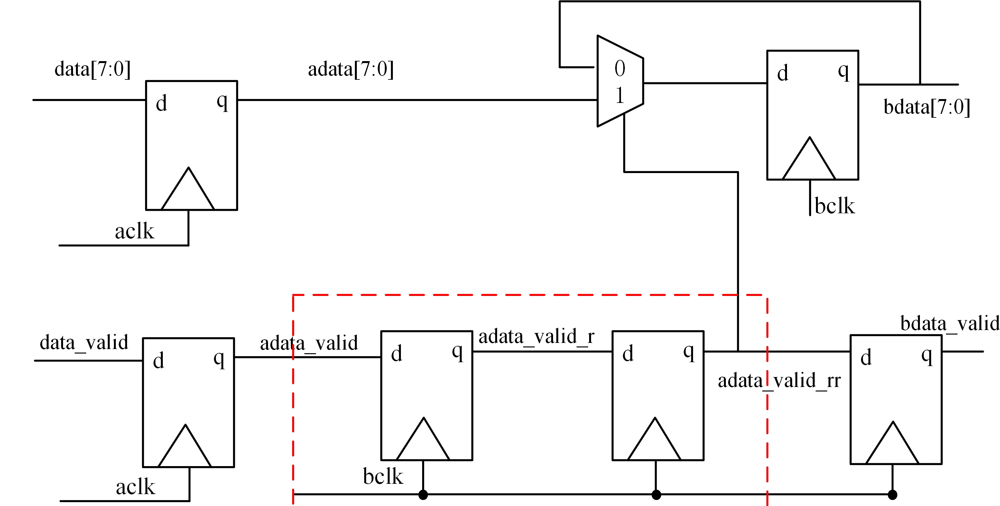

# DMUX

https://blog.csdn.net/weixin_43593478/article/details/137028706

dmux表示数据分配器，该方法适合**带数据有效标志信号**的**多bit数据**做跨时钟域传输(`慢到快`和`快到慢`)。其典型结构如下：

快时钟域到慢时钟域只要将红框中换成**单bit快时钟域到慢时钟域处理单元**即可。

`DMUX`遵循的原则就是，**数据不同步只对控制信号同步**，这点其实和异步`fifo`里的思路一样，只不多异步`fifo`中的控制信号是多比特的格雷码，而这个场景下的控制信号是`data_valid`。继续观察结构可以发现，`DMUX`是将单`bit`控制信号同步之后将其最为`mux`的选择信号。因此使用这个结构需要满足一些要求：

1.**数据和使能信号在源时钟域为同步到来的信号**；

2.**在目的时钟域对数据完成采样前，数据信号不能跳变**；

如果不满足以上的要求，那么就可能造成数据漏同步、错同步等问题。

## 优点：

- 简单性：DMUX同步器相对简单，易于实现，因为它主要依赖于数据使能信号的同步。
- 适用性：它适用于慢时钟域到快时钟域以及快时钟域到慢时钟域的数据传输。
- 减少亚稳态风险：通过使用DMUX同步器，可以减少亚稳态的风险，因为它通过同步数据使能信号来控制数据的传输。
- 灵活性：DMUX可以用于多种不同的跨时钟域场景，包括数据和控制信号的同步。

## 缺点：

- 数据稳定性要求：数据和使能信号在源时钟域需要同步到达，且在目的时钟域对数据完成采样前，数据信号不能跳变，这可能在某些情况下难以保证。
- 单向传输：DMUX通常设计为单向数据传输，即只能从源时钟域传输到目的时钟域，这限制了其应用的灵活性。
- 时钟频率限制：如果较快的时钟域是较慢时钟域频率的1.5倍或更多，将较慢的控制信号同步到较快的时钟域通常不是问题。但是，对于慢时钟域到快时钟域的情况，可能需要更复杂的处理，如在接收时钟域中采样信号要保持三个时钟边沿的时间。
- 可能的时序问题：在某些情况下，DMUX可能无法处理快速变化的数据，因为它依赖于数据使能信号的同步，这可能导致时序问题。

## 总结
在设计时，需要根据具体的应用场景和时钟域的特性来选择合适的同步策略，并可能需要结合其他技术（如异步FIFO、握手机制等）来确保数据的完整性和同步性。