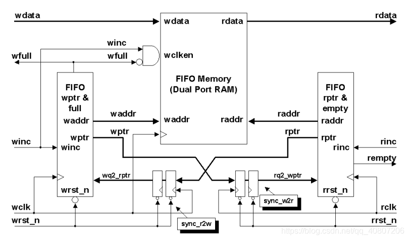
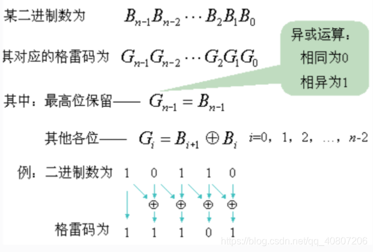
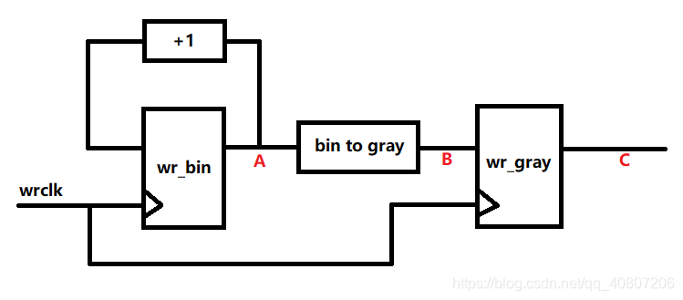

# 同步FIFO的两种Verilog设计方法（计数器法、高位扩展法）
https://blog.csdn.net/wuzhikaidetb/article/details/121136040

FIFO 与普通存储器 RAM 的区别是没有外部读写地址线，使用起来非常简单，但缺点就是只能顺序写 入数据，顺序的读出数据，其数据地址由内部读写指针自动加 1 完成，不能像普通存储器那样可以由地址线决定读取或写入某个指定的地址。 FIFO 本质上是由 RAM 加读写控制逻辑构成的一种先进先出的数据缓冲器。

## FIFO 的常见参数：

- FIFO 的宽度：即 FIFO 一次读写操作的数据位
- FIFO 的深度：指的是 FIFO 可以存储多少个 N 位的数据（如果宽度为 N）

## FIFO 读写指针（读写指针就是读写地址）的工作原理：

- 写指针：总是指向下一个将要被写入的单元，复位时，指向第 1 个单元(编号为 0) 
- 读指针：总是指向当前要被读出的数据，复位时，指向第 1 个单元(编号为 0) FIFO 的“空”/“满”检测 

 ## FIFO 设计的关键
 - 产生可靠的 FIFO 读写指针和生成 FIFO“空”/“满”状态标志。 
 - 当读写指针相等时，表明 FIFO 为空，这种情况发生在复位操作时，或者当读指针读出 FIFO 中最后一 个字后，追赶上了写指针时

 # 计数器法

   构建一个计数器，该计数器(fifo_cnt)用于指示当前 FIFO 中数据的个数：

- 复位时，该计数器为0，FIFO中的数据个数为0
- 当读写使能信号均有效时，说明又读又写，计数器不变，FIFO中的数据个数无变化
- 当写使能有效且 full=0，则 fifo_cnt +1；表示写操作且 FIFO 未满时候，FIFO 中的数据个数增加了 1 
- 当读使能有效且 empty=0，则 fifo_cnt -1;表示读操作且 FIFO 未空时候，FIFO 中的数据个数减少了 1 
- fifo_cnt =0 的时候，表示 FIFO 空，需要设置 empty=1；fifo_cnt = fifo的深度 的时候，表示 FIFO 现在已经满，需要设置 full=1

# 高位扩展法
 举例在深度为8的FIFO中，需要3bit的读写指针来分别指示读写地址3'b000-3'b111这8个地址。若将地址指针扩展1bit，则变成4bit的地址，而地址表示区间则变成了4'b0000-4'b1111。假设不看最高位的话，后面3位的表示区间仍然是3'b000-3'b111，也就意味着最高位可以拿来作为指示位。

- **当最高位不同，且其他位相同，则表示读指针或者写指针多跑了一圈，而显然不会让读指针多跑一圈（多跑一圈读啥？），所以可能出现的情况只能是写指针多跑了一圈，与就意味着FIFO被写满了**

- **当最高位相同，且其他位相同，则表示读指针追到了写指针或者写指针追到了读指针，而显然不会让写指针追读指针（这种情况只能是写指针超过读指针一圈），所以可能出现的情况只能是读指针追到了写指针，也就意味着FIFO被读空了**

# 异步FIFO设计
https://blog.csdn.net/qq_40807206/article/details/109555162
## 异步FIFO中深度必须是$2^n$
格雷码如果每2^n个数一循环，首尾两个格雷码仍然是只有一位变化，如果不是2^n个数，那么首尾数据就不是仅有一位变化，那就不是真正的格雷码，所以这也是异步FIFO的存储深度只能是2^n的原因
## 在实现这部分功能前先来捋一捋异步FIFO的一些重要概念：

1、FIFO数据宽度：FIFO一次读写的数据位宽。（与RAM数据位宽相同）

2、FIFO存储深度：FIFO可存储的固定位宽数据的个数。（与RAM存储深度相同）

3、读时钟：在每个读时钟的边沿来临时读数据。

4、写时钟：在每个写时钟的边沿来临时写数据。

5、读指针：指向下一个要读的地址，读完后自动加1。

6、写指针：指向下一个要写的地址，写完后自动加1。

读写指针其实就是读写的地址，只不过不能任意设置，只能连续自增。

7、空/满标志：为了保证FIFO的正确读写，而不发生写溢出或读空的情况，需要提供写满和读空的标志来提醒外部控制器此状态下不能再进行写/读操作。

**因为我们所设计的是异步FIFO，它的读写部分不是在同一个时钟域内工作，所以可以将它们划分为写时钟域和读时钟域，在两个时钟域各自控制本时钟域内的信号，并将两个时钟域内的一些有关信号进行跨时钟域处理来联合判断FIFO状态。**

由图可见，异步FIFO的核心部件就是一个 `Simple Dual Port RAM` ；

左右两边的长条矩形是地址控制器，负责控制地址自增、**将二进制地址转为格雷码**以及**解格雷码**；

下面的两对D触发器 `sync_r2w` 和 `sync_w2r `是同步器，负责将**写地址同步至读时钟域**、将**读地址同步至写时钟域**。

## 二进制地址转格雷码地址
异步FIFO是通过比较读指针和写指针的位置来判断FIFO是否写满或读空，但是**不可以直接比较两个指针**，因为**他们属于不同时钟域**，直接相比**可能会产生亚稳态**从而**引起误判**，这就需要将两个指针分别进行**跨时钟域处理**，然后再判断。

但是存在一个问题，自然二进制编码的地址在**状态翻转**的时候是**多位变化**，这就可能会产生**竞争现象**并**有可能被另一个时钟域的触发器采样到**，从而**引发误判**。最容易的解决方法就是**将自然二进制编码**的地址转为**格雷码编码**的地址。

### 自然二进制码转换成二进制格雷码
其法则是保留自然二进制码的最高位作为格雷码的最高位，而次高位格雷码为二进制码的高位与次高位相异或，而格雷码其余各位与次高位的求法相类似。 

## 竞争冒险问题

在**数字电路**中（组合逻辑和时序逻辑都一样），同一个信号源经过不同的路径（通路）到达某一个门电路的输入端。这个叫**竞争**

竞争针对的是门电路中的输入端：输入信号不能同时到达。

因为路径不同，存在时间差，导致两个信号到达时间有可能不同，导致门电路的输出产生干扰信号。这个叫**冒险**（产生风险）

解决方法：
- 增加冗余项
- 简化表达式
- 并联电容 （电容滤波）
- 也可以添加使能信号

有冒险一定有竞争，但是有竞争不一定有冒险。（输入竞争，但是加了使能信号，就可以消除冒险）

虽然将二进制转成了格雷码，但仍存在一个隐藏的竞争冒险问题，如下图所示：

上图是从二进制地址自增和转格雷码的RTL连接图

A点输出的是二进制数据，**可能存在多位变化**，但是经过转格雷码电路 `bin to gray` （组合逻辑电路）就不会产生竞争现象了吗?

当A点二进制数据**处于变化中的中间态**时，由于 `bin to gray` 是组合逻辑电路，那么B点也会出现**中间态二进制数据**对应的**格雷码数据**，这个**中间数据**就有可能被**读时钟域采样**到，从而再次**引发误判**。

解决方法就是在**二进制**转**格雷**码电路后**打一拍**转为**时序逻辑**电路，这样在写时钟的驱动下，`C`点数据每次更新必然只有一位在变化，就避免了出现冒险现象。

## 二进制格雷码转换成自然二进制码 

### 对同步后的格雷码地址解码

为什么要对格雷码解码？因为二进制下数据的规律更明显，便于后续判断标志位。

二进制格雷码转换成自然二进制码,其法则是**保留格雷码的最高**位作为**自然二进制码的最高位**，而**次高位自然二进制码**为**高位自然二进制码**与**次高位格雷码相**异或，而自然二进制码的其余各位与次高位自然二进制码的求法相类似。